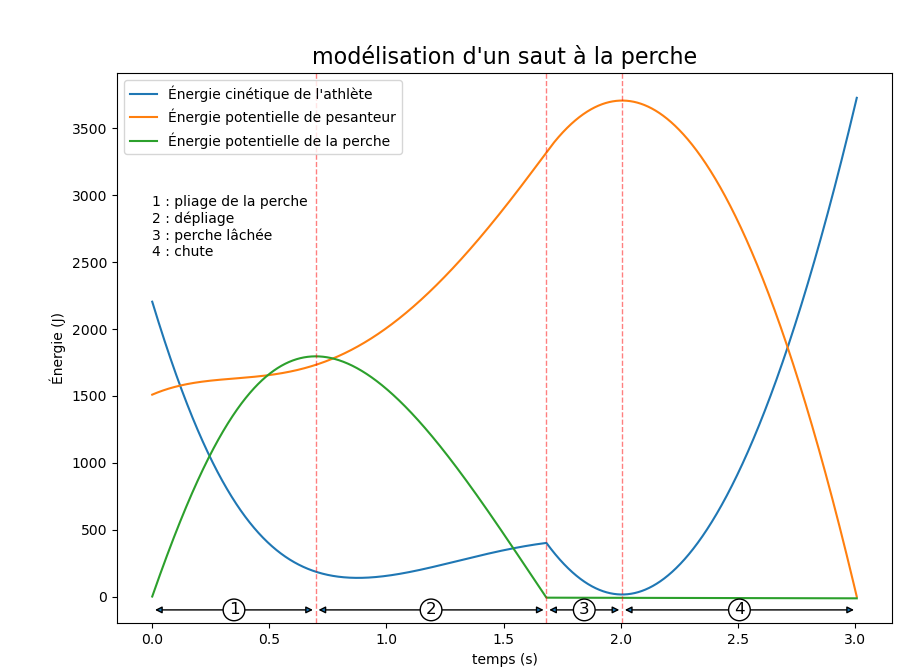
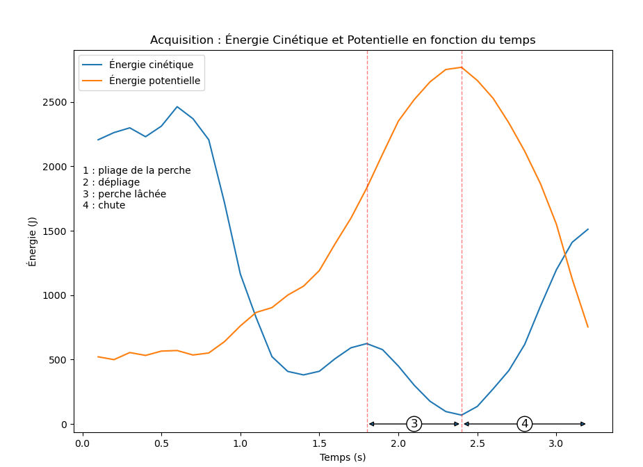
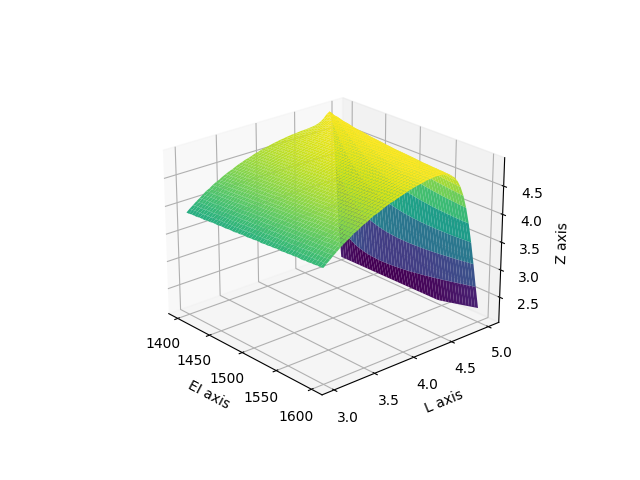

# 🧗 Stratégie de Sélection de Perche - Saut à la Perche (TIPE)

[cite_start]Ce projet de **TIPE (2023-2024)** présente une étude physique et numérique du saut à la perche[cite: 1, 7, 8]. [cite_start]L'objectif est de modéliser le transfert d'énergie lors d'un saut pour déterminer les caractéristiques optimales de la perche (rigidité $EI$ et longueur $L$) en fonction du profil de l'athlète[cite: 36, 38].

---

## 🎯 Problématique
[cite_start]**Quelles sont les caractéristiques de la perche à retenir en fonction des particularités (masse, vitesse) du perchiste ?** [cite: 38]

---

## ⚙️ Modélisation Théorique
[cite_start]Le projet repose sur l'application du **Principe Fondamental de la Dynamique (PFD)** dans un référentiel galiléen[cite: 338, 340]. 

### 1. Détermination de la force
[cite_start]La force exercée par la perche est modélisée à partir du module d'Young ($E$) et du moment quadratique ($I$) du matériau[cite: 54, 55, 78, 79]:
[cite_start]$$F(x) = 12\frac{EI}{L^{2}}(1+\frac{3}{5}\frac{x}{L})$$ [cite: 91]

### 2. Équations du mouvement
[cite_start]Le système d'équations différentielles projeté selon les axes $x$ et $z$ est le suivant[cite: 343]:
* [cite_start]**Axe x** : $m\frac{d^{2}x}{dt^{2}}=\frac{12}{5}\frac{EI}{L^{2}}(\frac{8}{\sqrt{x^{2}+(z+p^{2})}}-\frac{3}{L})x$ [cite: 129, 344]
* [cite_start]**Axe z** : $m\frac{d^{2}z}{dt^{2}}=\frac{12}{5}\frac{EI}{L^{2}}(\frac{8}{\sqrt{x^{2}+(z+p^{2})}}-\frac{3}{L})z-mg$ [cite: 130, 347]


---

## 💻 Simulations Numériques (Python)
Le dépôt contient plusieurs scripts permettant de simuler et d'optimiser le saut.

### 📊 Analyse Énergétique (`saut_perche_modelisation.py`)
[cite_start]Ce script utilise la **méthode d'Euler** pour résoudre les équations du mouvement[cite: 353, 366]. [cite_start]Il permet de visualiser la conversion de l'énergie cinétique en énergie potentielle élastique puis en énergie de pesanteur[cite: 31, 138, 153].


[cite_start]*Figure 1 : Phases du saut : (1) Pliage, (2) Dépliage, (3) Perche lâchée, (4) Chute.* [cite: 153, 154, 155, 156]

### 📉 Comparaison Expérimentale (`Mesure_video.py`)
[cite_start]Traitement de données issues d'une acquisition réelle pour valider le modèle théorique[cite: 171, 198].


[cite_start]*Figure 2 : Évolution des énergies cinétique et potentielle issue de mesures réelles.* [cite: 202, 203]

---

## 🚀 Optimisation 3D (`Modélisation3D.py`)
[cite_start]Pour identifier la perche idéale, le script génère une surface 3D représentant la hauteur maximale $Z$ atteinte en fonction de la rigidité ($EI$) et de la longueur ($L$)[cite: 231, 403, 410].


[cite_start]*Figure 3 : Recherche du maximum de hauteur Z selon les paramètres de la perche.* [cite: 242, 245, 252]

---

## 📂 Structure du Projet
* [cite_start]`saut_perche_modelisation.py` : Résolution numérique par la méthode d'Euler[cite: 353].
* `Mesure_video.py` : Analyse et tracé des données d'acquisition expérimentale.
* [cite_start]`Modélisation3D.py` : Script de génération de la surface d'optimisation 3D[cite: 401, 413].
* [cite_start]`KUZU_KEVIN_SOUTENANCE_TIPE.pdf` : Support complet de la présentation orale[cite: 1, 2].

## 🛠️ Installation
```bash
pip install matplotlib numpy pandas
